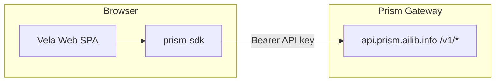
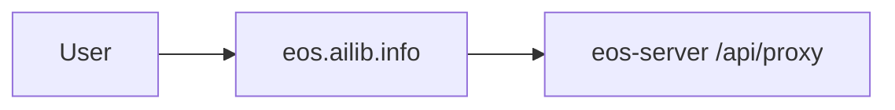

# Vela — AI Navigation Client (A-layer)

> **Vela is not Eos.** Vela is an open-source navigation client that talks to **Prism Gateway** (`api.prism.ailib.info`). **Eos（逸思）** is a separate To C website at `eos.ailib.info` with its own backend (`/api/proxy`).

Monorepo for Phase 1 (PR-V1-001):

| Package | Description |
|---------|-------------|
| `@ailib-official/prism-sdk` | Thin TypeScript client for Prism `/v1/*` |
| `@ailib-official/vela-web` | React + Vite chat demo |

## Architecture



**Eos (different product):**



## Prerequisites

- Node.js ≥ 18
- [pnpm](https://pnpm.io/) 9.x
- Prism gateway API key (`PRISM_GATEWAY_API_KEY`)

## Quick start

```bash
pnpm install
cp apps/web/.env.example apps/web/.env.local
# Edit apps/web/.env.local — set VITE_PRISM_API_KEY

pnpm dev
# Open http://localhost:5173
```

Dev mode uses a **Vite proxy** (`/v1` → `api.prism.ailib.info`) to avoid browser CORS.

## Build

```bash
pnpm build
pnpm test
```

## Publish prism-sdk

```bash
cd packages/prism-sdk
pnpm build
npm publish --access public
```

Requires `NPM_TOKEN` with `@ailib-official` scope.

## License

Apache-2.0
